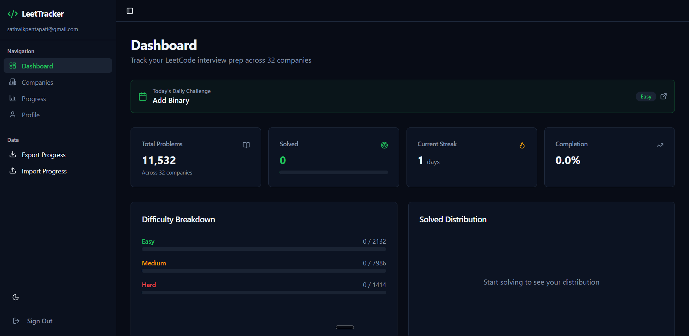
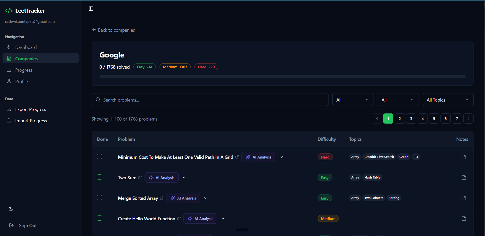

# 🚀 LeetTracker - Company Coding Journey



A modern, full-stack application to track your LeetCode progress, focusing on company-specific interview preparation. Built with **React**, **Vite**, **TypeScript**, **Tailwind CSS**, and **Supabase**.

Now powered by **Google Gemini AI** for instant problem analysis and hints! ✨

## ✨ Key Features

- **📊 Comprehensive Dashboard**: Track your solved problems, current streak, and difficulty breakdown at a glance.
- **🏢 Company-Specific Lists**: Curated problem lists for top tech companies (Google, Meta, Amazon, etc.).
- **🤖 AI Analysis (New!)**: Get instant summaries, key algorithms, time/space complexity analysis, and hints for any problem using Gemini AI.
- **👤 User Profile**: Manage your profile, upload a picture, and link your LeetCode username.
- **🔑 Secure API Key Management**: Configure your Gemini API key and preferred model directly in the app (stored locally in your browser).
- **🌗 Dark Mode**: Slick, developer-friendly dark interface.
- **📱 Responsive Design**: Works seamlessly on desktop and mobile.

## 📸 Screenshots

| AI Analysis | Company Problems |
|:-----------:|:----------------:|
|  |  |
| *Get instant problem breakdowns* | *Track progress per company* |

## 🛠️ Tech Stack

- **Frontend**: React, TypeScript, Vite
- **Styling**: Tailwind CSS, Shadcn UI, Framer Motion
- **Backend/Auth**: Supabase
- **AI**: Google Gemini API (`@google/generative-ai`)
- **State Management**: React Query, Context API
- **Routing**: React Router DOM

## 🚀 Getting Started

### Prerequisites

- Node.js (v18+)
- npm or yarn
- A Supabase project (for authentication)
- A Google Gemini API Key

### Installation

1.  **Clone the repository**
    ```bash
    git clone https://github.com/yourusername/leettracker.git
    cd leettracker
    ```

2.  **Install dependencies**
    ```bash
    npm install
    ```

3.  **Environment Setup**
    Create a `.env` file in the root directory:
    ```env
    VITE_SUPABASE_PROJECT_ID="Your_ID"
   VITE_SUPABASE_PUBLISHABLE_KEY="<your_key>"
   VITE_SUPABASE_URL="<Your_url>"
   VITE_GEMINI_API_KEY="<Your_Api_Key>"
    ```

4.  **Run the development server**
    ```bash
    npm run dev
    ```

## 🤖 Configuring AI Features

1.  Navigate to the **Profile** page in the app.
2.  Scroll down to **Gemini API Configuration**.
3.  Enter your **API Key** (Get one from [Google AI Studio](https://aistudio.google.com/)).
4.  (Optional) Set your preferred **AI Model** (defaults to `gemini-3-flash-preview`).
5.  Click **Test** and then **Save Changes**.

## 🤝 Contributing

Contributions are welcome! Please feel free to submit a Pull Request.

## 📄 License

This project is open source and available under the [MIT License](LICENSE).
